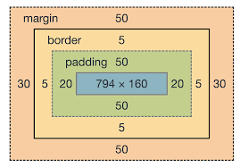

# 📝 Today I Learn
## 🗓️ 날짜: 2024-10-29
### 🙏🏻 스크럼
- 학습 목표 1 : Node.js
- 학습 목표 2 : HTML
- 학습 목표 3 : CSS
- 학습 목표 4 : BoxModel
- 학습 목표 5 : Flex 
 

### | Node.js
#### 어디에서나 자바스크립트를 사용할 수 있도록 하는 런타임 환경
- 사용 이유: 다양한 용도의 프로그램을 개발할 때 JS로 개발하기 위해
- 사용 방법: node.js를 설치한 후, 터미널 또는 CMD에서 명령어를 통해 자바스크립트 파일 실행

### | HTML
#### 웹 페이지의 구조와 내용을 정의하기 위한 언어
- 사용 이유: 웹 브라우저가 문서를 해석해 시각적으로 홈페이지 구조를 표현할 수 있게 하기 위해
- 사용 방법: HTML 언어에서 지원하는 태그 사용
    - 태그: 웹 페이지의 구조와 내용을 구분하는 요소로 사용
    - 요소: 시작 태그, 내용, 종료 태그로 구성된 웹 페이지의 구성 부분

### | CSS
#### 웹 문서의 전반적 스타일을 미리 저장해 둔 스타일 시트
- 사용 이유: HTML 문서에 있는 태그들에 스타일을 적용하여 시각적으로 사용자에게 편리함을 제공하기 위해
- 사용 방법: `<style>` 태그를 사용하거나, 외부 스타일시트 파일은 `<link>` 태그로 HTML문서에 연결
    - 선택자: 웹 페이지 특정 부분을 지정해 스타일을 적용하기 위한 이름이나 기호 (요소/ 클래스/ ID)

### | BoxModel
#### HTML 요소를 내용, 패딩, 테두리, 여백 등의 영역으로 나누어 사각형 박스로 표현하는 방법
- 사용 이유: 웹 페이지 요소를 구조화하고 크기, 여백을 제어하기 위해
- 사용 방법: 요소의 여러가지 속성을 CSS에서 설정해서 사용
    

### | Flex
#### 웹 페이지 요소들을 유연하게 배치하고 조정하기 위한 레이아웃 모델
- 사용 이유: 다양한 화면 크기에 대응하는 반응형 웹디자인을 쉽게 구현하기 위해서
- 사용 방법: Flex 사용 방법의 핵심은 부모 요소에 Flex 속성을 적용해 자식 요소들의 배치, 방향, 간격을 유연히 조절하는 것
    - Flex Container: Flex 내부의 아이템을 감싸는 영역
    - Flex Item: 데이터 집합 요소 항목, 즉 관련 있는 필드 모임 (Flex 배치 시 실질적으로 배치되는 것들)
    - Flex Direction: Flex 컨테이너 안의 아이템들이 나열되는 방향을 정하는 CSS 속성 (메인 축 결정 - 가로: row, 세로: column)
    - Align Items: Flex 컨테이너 안의 아이템들을 교차룩에 대해 어떻게 정렬할지 설정하는 CSS 속성 (세로축에 대해 상단, 중단, 하단)
    - Justify Content: Flex 컨테이너 안 아이템들의 메인 축에 대해 어떻게 정렬할 지 설정하는 CSS 속성 (메인 축에 대해 시작점, 중앙, 끝점 or 사이에 공간)
    - Flex Grow: 아이템이 컨테이너 내 여분 공간을 어떻게 확장할 지 결정하는 속성
    - Flex Shrink: 아이템이 공간이 부족할 때 어떻게 축소될지 결정하는 속성
    - Flex Basis: 아이템의 초기 크기를 결정하는 속성
    - Flex Wrap: 컨테이너 안 아이템들이 한줄에 모두 표시되지 않을 때 다음 줄로 넘어갈 지 여부를 결정하는 CSS 속성
 

### ✊🏻 오늘의 도전 과제와 해결 방법
- 도전 과제 1: 리틀리 만들어보기
- 도전 과제 2: express 미니퀘스트 & 과제 (Node.js, HTML & CSS 1번 ~ Flex)
- 도전 과제 3: git 미니퀘스트 3번 보강

### 💭 오늘의 회고
- 각 개념들을 이해하고 사용 방법을 조금씩은 익힌 것 같다. 
- 리틀리 만들어보기를 통해 전체적인 웹페이지 구조를 깨달았다.
- form 태그 사용법에 대해 익혔다.

### 🔗 참고 자료 및 링크
- [Node.js](https://www.notion.so/adapterz/Node-js-12d394a4806180e7a948eebda23fc554?pvs=4)
- [HTML](https://www.notion.so/adapterz/HTML-12d394a48061808392c0ff801156ef1d?pvs=4)
- [CSS](https://www.notion.so/adapterz/CSS-12d394a4806180059c45dbf3e932ad14?pvs=4)
- [BoxModel](https://www.notion.so/adapterz/Boxmodel-12d394a48061808197b8e34f563c4455?pvs=4)
- [Flex](https://www.notion.so/adapterz/Flex-12d394a480618031ac7bfe731dfbeac3?pvs=4)