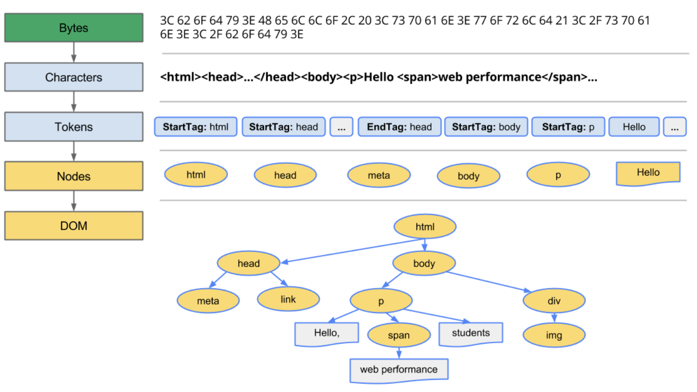

# 📝 Today I Learn

## 🗓️ 날짜: 2024-10-30

### 🙏🏻 스크럼
- 학습 목표 1 : Event
- 학습 목표 2 : Fetch
- 학습 목표 3 : DOM
- 학습 목표 4 : Lottie 

### | Event
#### 사용자가 웹페이지에서 수행하는 동작 (마우스 클릭과 이동, 키보드 입력)
- 사용 이유: 사용자와 웹페이지 간 상호작용을 위해서
- 사용 방법: 이벤트 리스너, 이벤트 핸들러를 사용해 이벤트 관리

  - 이벤트 리스너: 사용자 행동으로 이벤트 발생 시 지정 함수나 동작을 실행하는 프로그램 일부 (특정 이벤트 발생 시 알려주는 역할)
  - 이벤트 핸들러: 특정 이벤트 발생 시 (이벤트 리스너에 의해) 감지하고 대응하는 작업을 수행하는 프로그램 코드 부분

### | Fetch
#### 컴퓨터가 무엇을 해야할지 알려주는 지시를 읽고, 그에 따라 필요한 정보를 찾아 실행하는 단계
- 사용 이유: 컴퓨터가 지시된 작업을 정확히 수행하기 위해 필요한 정보를 불러오려고
- 사용 방법: Fetch 문법 사용

    - 웹 개발에서 중요한 역할, 동적 웹 애플리케이션 구현에 필수적 
    - 프론트엔드에서 백엔드로 데이터 요청 시 필수적인 사용

### | DOM
#### HTML 코드가 브라우저에 의해 파싱되어 메모리 상에 객체 형태로 구성되어 동작하고 있는 코드
- 사용 이유: 브라우저가 HTML 코드를 로드하고 해석하는 과정, 웹페이지를 동적으로 조작하기 위해 (웹페이지 로드 후에도 사용자 상호작용이나 다른 프로그래밍 로직에 의해 웹페이지 내용, 구조, 스타일 실시간 변경 가능)
- 사용 방법: 브라우저가 HTML 코드를 DOM-TREE로 만들어주면 JS로 조작

    
    

### | Lottie
#### JSON 기반 애니메이션 파일
- 사용 이유: 애니메이션 파일(gif, mp4)에 비해 파일 크기 작음, 벡터 기반 애니메이션이라 크기 조정 자유로움, 애니메이션 요소가 드러나 있어 상호작용하도록 수정 가능
- 사용 방법: 이미 존재하는 애니메이션 사용 or 나만의 애니메이션 만들어 사용
 

### ✊🏻 오늘의 도전 과제와 해결 방법
- 도전 과제 1: express 미니퀘스트 & 과제 (Lottie 1/2, Express.js 설치 ~ REST)

### 💭 오늘의 회고
- Event를 그냥 사용만 하고 있었는데 정확히 어떤 동작을 하는 지 알게되었다.
- Fetch 문법은 사용을 좀 해봐야 이해가 더 잘 갈 것 같다.
- DOM이 중요하다고 하여 잘 기억하고 있어야겠다.

### 🔗 참고 자료 및 링크
- [Event](https://www.notion.so/adapterz/Event-12d394a48061809498e9d796edbec542?pvs=4)
- [Fetch](https://www.notion.so/adapterz/Fetch-12d394a4806180cca1f1c070b8a8180f?pvs=4)
- [DOM](https://www.notion.so/adapterz/DOM-12d394a48061802eb56ad065b1c80fed?pvs=4)
- [Lottie](https://www.notion.so/adapterz/Lottie-12d394a4806180bab0eae3545abe3111?pvs=4)