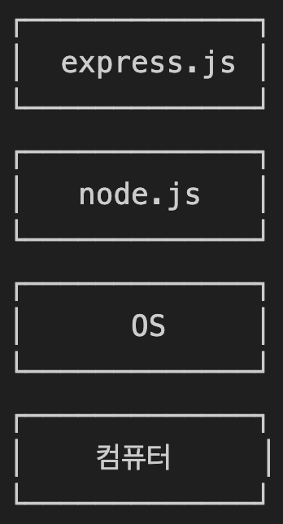

# 📝 Today I Learn
## 🗓️ 날짜: 2024-10-31
### 🙏🏻 스크럼
- 학습 목표 1 : Express.js
- 학습 목표 2 : 코드 컨벤션
- 학습 목표 3 : HTTP - Request Method
- 학습 목표 4 : HTTP - Status Code
- 학습 목표 5 : REST
 

### | Express.js
#### Node.js를 기반으로 동작하는 웹 애플리케이션 프레임워크
- 사용 이유: 웹 애플리케이션을 개발하기 편리해서
- 사용 방법: express.js 설치 후, express 애플리케이션 생성
    - node.js를 이용해 웹서버를 구축하기는 복잡하니, express 프레임워크를 사용해 간편하게 웹서버 구축 
     
    
    
### | 코드 컨벤션
#### 코드 스타일 규약
- 사용 이유: 코드 가독성을 높이고, 협업을 원활히 하기 위해
- 사용 방법: 팀에서 코드 작성 규칙을 만들어 일관되게 적용

### | HTTP - Request Method
#### 웹 서버에게 어떤 작업을 수행하길 원하는지 알리는 방법을 정의하는 명령 규칙
- 사용 이유: 웹 서버에게 구체적 작업을 명확히 지시하기 위해
- 사용 방법: 웹 요청을 보낼 때, URL과 함께 메소드를 명시해 서버에 특정 작업 요청
    - GET 메서드: 서버로부터 데이터 조회 요청 시 사용하는 메서드 (요청 파라미터를 Query String 형태로 URL에 포함시켜 전송)
    - POST 메서드: 서버로 데이터를 전송해 리소스 생성, 업데이트할 때 사용하는 메서드 (Request Body에 데이터 첨부해 전송)
    - PUT 메서드: 서버로 데이터를 전송하여 리소스를 "전체" 업데이트할 때 사용하는 메서드 (Request Body에 데이터를 첨부해 전송)
    - PATCH 메서드: 서버 리소스를 부분적으로 수정 또는 업데이트할 때 사용하는 메서드 (Request Body에 변경하고자 하는 데이터를 첨부해 전송)
    - DELETE 메서드: 서버로부터 리소스 삭제 시 사용하는 메서드 (URL에 삭제하고자 하는 리소스 식별자를 포함해 전송)

### | HTTP - Status Code
#### HTTP (일반 문서를 뛰어넘는 구조화된 텍스트를 전송하기 위해 사용되는 통신 규약)의 진행 상태를 표시하는 코드
- 사용 이유: 클라이언트가 웹 서버에 요청을 했을 때  통신 결과를 웹 서버가 클라이언트에게 명확히 전달하기 위해
- 사용 방법: 요청 처리 결과를 나타내는 HTTP 상태 코드를 응답 메시지 헤더에 포함시켜 클라이언트에 전송
    - 1xx: 정보 메시지
    - 2xx: 성공
    - 3xx: 리다이렉션
    - 4xx: 클라이언트 오류
    - 5xx: 서버 오류
     
    🔗 [다양한 상태 코드](https://developer.mozilla.org/ko/docs/Web/HTTP/Status)

### | REST
#### 자원을 이름으로 식별하고 해당 자원 상태(정보)를 구조화된 형식으로 표현하여, 서버와 클라이언트 간 정보를 교환하는 방식
- 사용 이유: 쉽게 구현, 수정할 수 잇고 여러 플랫폼에서 사용할 수 있기 때문
- 사용 방법: REST 아키텍처 스타일을 따라 개발 진행
    - 클라이언트-서버 분리: 클라이언트와 서버의 독립적 개발과 운영을 가능하게함
    - 명확한 데이터 표현: 자원과 행위가 명확히 표현되어 API를 통해 데이터 구조와 통신 내용을 쉽게 이해할 수 있음
    - 이해하기 쉬운 API: API의 구조만 봐도 통신 내용을 알 수 있어 사용과 통합이 간결하고 직관적
     

    - REST API: REST 아키텍처 스타일을 따르는 API
    - RESTful: 일반적으로 REST라는 아키텍처를 구현하는 웹서비스를 표현하기 위해 사용하는 용어
     
    
    `<REST 아키텍처 스타일>`
    - Uniform Interface: 모든 API가 일관된 방식으로  통신하도록해, 사용하는 데 있어 단순성과 상호운용성을 보장해야함
    - Client-Server: 클라이언트와 서버의 독립적 구분, 각각 개발 확장이 편리하고 사용자 인터페이스와 데이터 저장소가 분리되어 있어야함
    - Stateless: 서버는 클라이언트의 상태 정보를 저장하지 않아야함, 각각 요청이 독립적이며 필요한 모든 정보를 포함해야함
    - Cacheable: 응답은 캐싱이 가능하도록 명시되어야 함
    - Layered System: 클라이언트는 서버가 단일 서버인지 다중 계층을 통해 데이터를 전달하는 중계서버를 거치는 지 알 수 없어야함 
    - Self-Descriptiveness: 메시지 자체가 충분한 정보를 담고 있어, 클라이언트가 어떻게 처리해야할 지 알 수 있어야 함
 

### ✊🏻 오늘의 도전 과제와 해결 방법
- 도전 과제 1: express 과제 (Lottie, Express.js 설치 ~ REST)

### 💭 오늘의 회고
- Express.js가 어떤 역할을 하는 지 알고 설치하여 사용할 수 있게 됨
- HTTP에 대해 당장 자주 사용하는 코드 부분들을 깊게 배우니 코드 사용에서 한층 이해가 쉬워짐

### 🔗 참고 자료 및 링크
- [Express.js](https://www.notion.so/adapterz/Express-js-12d394a4806180cf90f3e86859518550?pvs=4)
- [코드 컨벤션](https://www.notion.so/adapterz/12d394a4806180a39074d4598edc8154?pvs=4)
- [HTTP - Request Method](https://www.notion.so/adapterz/HTTP-Request-Method-12d394a4806180449334fea5c5ed529a?pvs=4)
- [HTTP - Status Code](https://www.notion.so/adapterz/HTTP-Status-Code-12d394a4806180f78e19dab7f2c47bf5?pvs=4)
- [REST](https://www.notion.so/adapterz/REST-12d394a48061804095a0cbf012887c38?pvs=4)